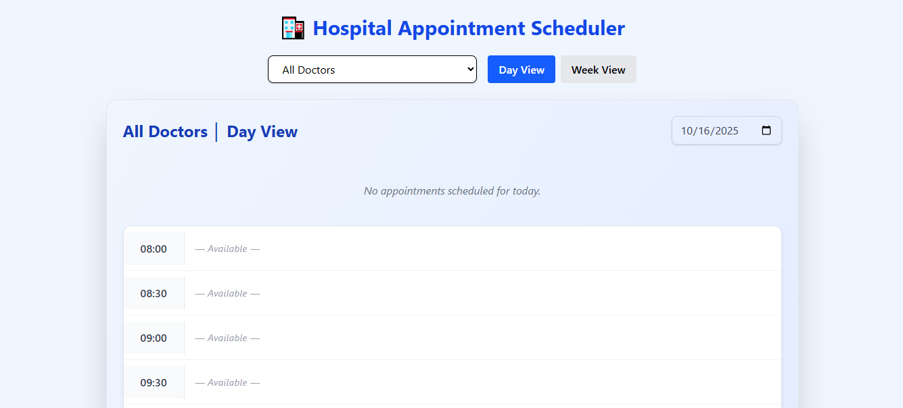
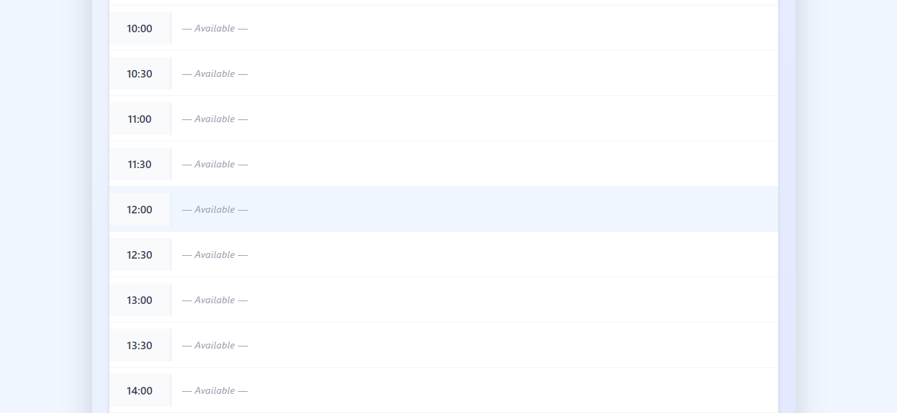
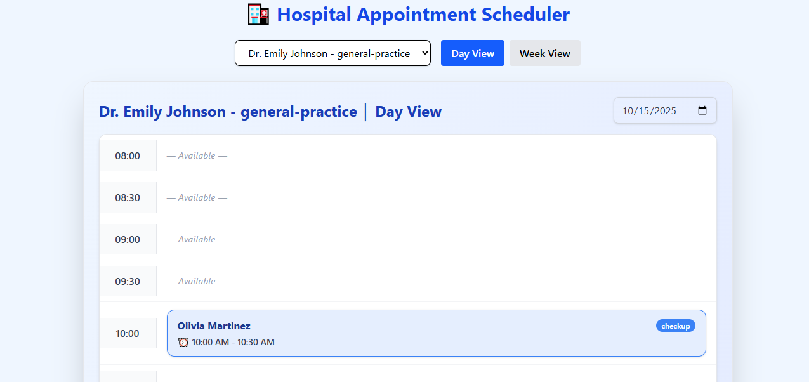
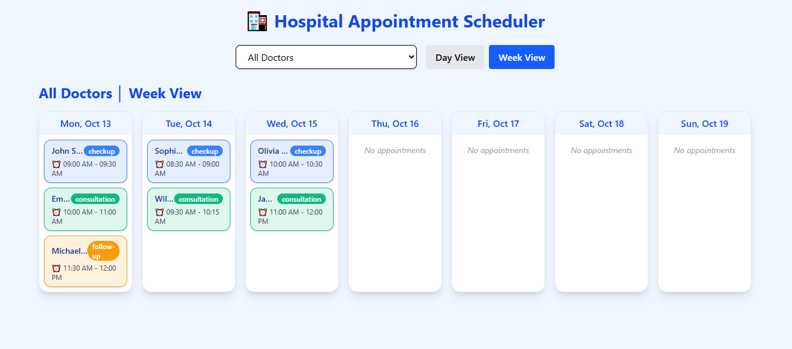

# Hospital Appointment Scheduler







A **React-based hospital appointment scheduler** that allows users to view appointments in **day and week views**. The project demonstrates clean architecture, responsive UI, and color-coded appointment types for better usability.

## 🌐 Live Demo

[Click here to view the live application](https://hospital-appointment-scheduler-pi.vercel.app/)

## 📂 GitHub Repository

[Hospital Appointment Scheduler Repository](https://github.com/Munchunnce/hospital-appointment-scheduler)

## 🏥 Features

- **Day View Calendar:**  
  - Displays appointments for a selected doctor by day  
  - Time slots from 8 AM to 6 PM (30-minute intervals)  
  - Patient name, appointment type, and duration shown  
  - Color-coded by appointment type  
  - Handles overlapping appointments gracefully

- **Week View Calendar:**  
  - Displays appointments across 7 days (Mon–Sun)  
  - Responsive layout for desktop and mobile  
  - Correct positioning of appointments by day and time

- **Doctor Filtering:**  
  - Dropdown to select a doctor (for front desk staff)  
  - Displays doctor name, specialty, and working hours  
  - Filters appointments based on selected doctor

- **UI/UX:**  
  - Modern, clean, and responsive design  
  - Appointment types color-coded:  
    - Checkup: Blue  
    - Consultation: Green  
    - Follow-up: Orange  
    - Procedure: Red  
  - Loading and empty states handled elegantly

## ⚡ Tech Stack

- React.js  
- Tailwind CSS
- date-fns (Date utilities)  
- Vercel (Deployment)

## 🏗️ Architecture & Implementation

- **Headless Components / Custom Hooks:**  
  Logic separated from UI for reusability and clarity.  

- **Service Layer:**  
  Abstracted API calls and data fetching in `appointmentService.js`.  

- **Composable Components:**  
  `ScheduleView`, `DayView`, `WeekView`, `DoctorSelector`  
  allow easy integration and reuse.  

- **Domain Models:**  
  Optional models for `TimeSlot` and `Appointment` for internal logic.

## 📝 Setup Instructions

1. **Clone Repository**
   ```bash
   git clone https://github.com/Munchunnce/hospital-appointment-scheduler.git
   cd hospital-appointment-scheduler
````

2. **Install Dependencies**

   ```bash
   npm install
   ```

3. **Run Locally**

   ```bash
   npm run dev
   ```

4. **Visit App**
   Open [http://localhost:3000](http://localhost:3000) in your browser

## 📸 Screenshots

Include a screenshot in your repo root named `screenshot.png` for this markdown to render correctly.
You can take a screenshot like this:

* Desktop: Press `PrtSc` or `Windows + Shift + S`
* Mac: Press `Cmd + Shift + 4`

Then save the image as `screenshot.png` in the root of your repository.

## ✅ Notes

* Project is **fully responsive**
* Mock data for **3 doctors, 50 patients, and appointments**
* Deploys smoothly on **Vercel**

---

Prepared by **Vimal Kumar Chaudhary**
Frontend Developer | Software Developer